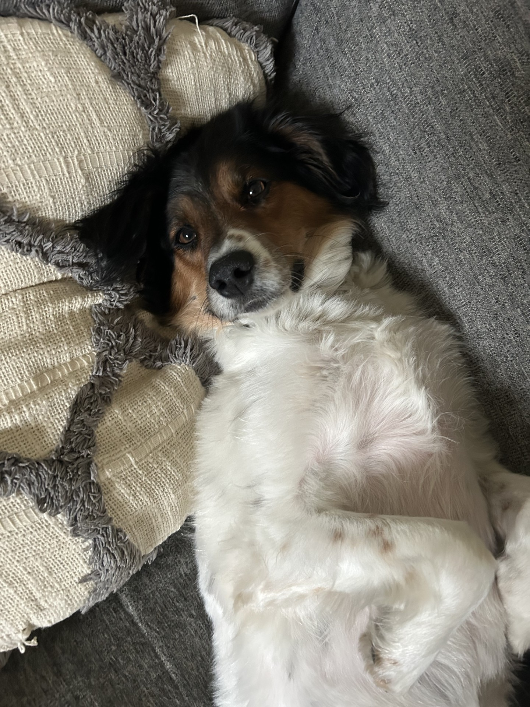
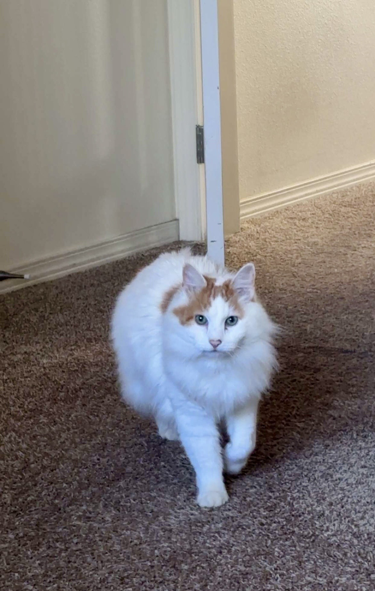
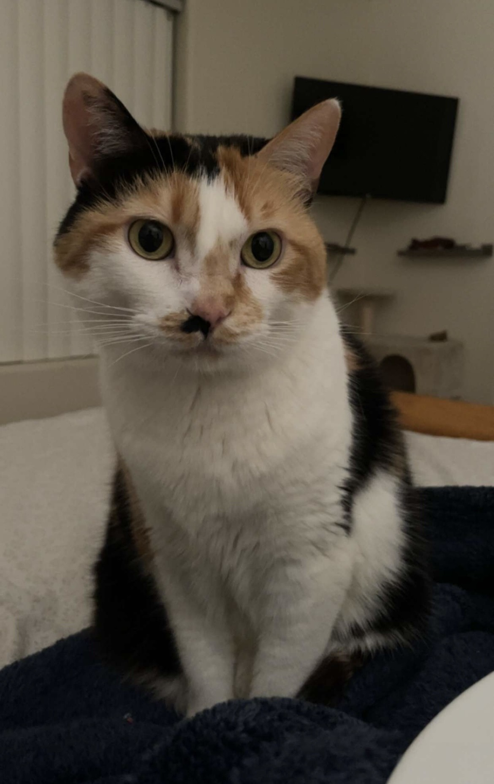

```{r setup, include=FALSE}
knitr::opts_chunk$set(echo = TRUE)
```

<div style="text-align: center; margin-bottom: 25px;">

</div>

I earned my Ph.D. in Bioinformatics and Computational Biology and my M.S. in Statistical Science from the University of Idaho. I currently work as a Full-Stack Web Developer with the University of Idaho's Research Computing and Data Services (RCDS), where I collaborate with researchers across a wide range of disciplines to develop software, data-driven applications, and AI-enabled research solutions.

My passion for statistics began during my undergraduate studies while working on ecological research projects involving dam flow impacts on Montana river systems and tailwater trout populations, as well as modeling goshawk population dynamics in southwest Montana. Those experiences sparked a lasting interest in using quantitative methods to better understand complex biological systems.

During my doctoral research, I studied gene regulatory networks using modern machine learning approaches, including graph neural networks, with a focus on developing new statistical and computational methods for biological data analysis. Today, I continue to enjoy applying statistics, programming, and artificial intelligence to solve challenging research problems and help transform innovative ideas into practical research tools.

Outside of work, I enjoy spending time with my wife, Grace, our dog Mabel, and our two cats, Pumpkin and Baby Cat. When I'm not coding or analyzing data, you'll usually find me fishing, playing board games, enjoying video games, or exploring the outdoors.

## Meet the Pets

<div style="display: flex; flex-wrap: wrap; gap: 20px; justify-content: center; text-align: center;">

<div>

<br>**Mabel**
</div>

<div>

<br>**Pumpkin**
</div>

<div>

<br>**Baby Cat**
</div>

</div>
