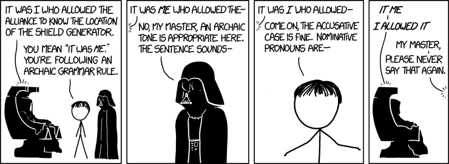
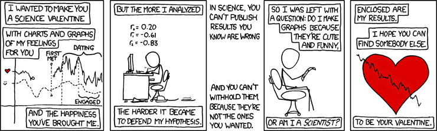

```{r setup, include=FALSE}
knitr::opts_chunk$set(echo = TRUE)
```


This site contains material for Jarred Kvamme's Statistical Methods course (STAT 251-03) at the University of Idaho for the spring semester of 2024.


```{r echo=FALSE, out.width='100%'}

```

<!--  -->

[**https://xkcd.com/1772**](https://xkcd.com/1772)


```{r echo=FALSE, out.width='100%'}

```

<!--  -->

[**https://xkcd.com/1772**](https://xkcd.com/701)